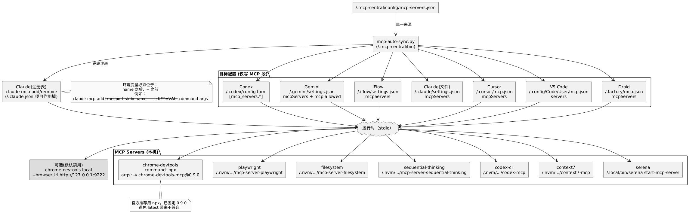

# MCP Local Manager


快速使用（两条路径：脚本或 CLI）
```
# 脚本路径（保留）
bash scripts/install-mac.sh   # 首次安装：体检→渲染→同步→体检
bash scripts/mcp-sync.sh      # 可选：全量同步（只改 MCP 段）
bash scripts/mcp-check.sh     # 只读健康检查

# CLI 路径（推荐日常使用）
# 将所选 MCP 仅应用到某个 CLI/IDE：
mcpctl apply-cli --client claude --servers context7,serena
# 交互选择并应用：
mcpctl pick
# 应用后直接启动：
mcpctl run --client claude --servers context7,serena -- claude
# 查看单个客户端当前集合：
mcpctl status codex   # 等价于：mcpctl status --client codex
# IDE（VS Code/Cursor）统一写入全部，具体开关在 IDE 内操作：
mcpctl ide-all
```

用途：在 macOS 与 Linux 上以“单一来源”管理所有 CLI/编辑器的 MCP 服务器配置，做到一次修改、处处生效；并提供一键同步与只读健康检查。

核心理念：
- 统一来源：`~/.mcp-central/config/mcp-servers.json`
- 仅改 MCP 段：不同目标只写入各自 MCP 部分（如 Codex 的 `[mcp_servers.*]`、Gemini 的 `mcpServers` 等），不触碰其它设置
- Claude：文件为主（`~/.claude/settings.json`），命令兜底仅补“缺失项”
 - 默认全部启用：清单里未显式写 `enabled: false` 的服务都视为启用；是否真正“加载”，由你对某个 CLI/IDE 的落地选择决定。

推荐基线：
- Node 生态 MCP 一律使用 `npx -y <package>@latest`，便于获得上游修复（如 `task-master-ai`）。
- 仅 `serena` 走本地二进制（`~/.local/bin/serena`）。
- 日常建议：仅对 Cursor 落地所需 MCP，其他 CLI/IDE 保持“裸奔”。
- 混合策略：默认优先 npx；若某客户端（如 Gemini）对某个服务（如 `task-master-ai`）不稳定，则改为“全局二进制直连”（`npm i -g <pkg>@latest`，`command` 改为该二进制）。

与最新方案对齐：
- 不使用 wrappers；所有 server 直连二进制或官方推荐方式。
- 统一采用显式最新版（@latest）以便始终获得更新：
  `command: "npx"`, `args: ["-y","<package>@latest"]`；除特殊场景（如 Chrome DevTools 的禁沙箱）外，无需设置 PATH/npm_config_prefix 等环境变量。

## 目录

```
mcp-local-manager/
├─ bin/
│  ├─ mcp-auto-sync.py        # 跨平台同步（保留）
│  └─ mcpctl                  # 终端 CLI（按客户端落地/查看/启动）
├─ scripts/
│  ├─ install-mac.sh          # 首次安装：体检→渲染→同步→体检
│  ├─ mcp-sync.sh             # 可选：全量同步（只改 MCP 段）
│  └─ mcp-check.sh            # 健康检查（只读）
├─ config/
│  └─ mcp-servers.sample.json # 示例统一清单（可参考）
└─ docs/
   └─ QUICKSTART-mac.md       # 快速上手与常见路径
```

## 架构图



重新渲染（自动检测本地渲染器，优先 Mermaid CLI→PlantUML）：
```
bash scripts/render-diagrams.sh
```
详细说明见：`docs/RENDER_DIAGRAMS.md`

## 快速上手

1. 体检 + 渲染统一清单 + 同步 + 体检
```
bash scripts/install-mac.sh
```
- 脚本已自动：
  - 同步各客户端 MCP（只改 MCP 段）
  - 可选预热 npx 缓存（减少首次拉包失败）
  - 运行体检并附带连通性探测（`--probe`）：调用 `claude mcp list`、`gemini mcp list` 等一并输出，便于“一次看清楚”。

2. 之后日常更建议：
```
# Claude 轻量会话（只启用 context7+serena）：
mcpctl run --client claude --servers context7,serena -- claude

# IDE 全量可选（VS Code/Cursor）：
mcpctl ide-all

# 查看当前落地到某客户端的集合：
mcpctl status claude    # 或 codex / vscode / cursor ...

若使用 task-master-ai 且指定 `@latest`，首次启用如遇 npx 依赖缓存问题（`@inquirer/search` 等缺失），请参考 `docs/troubleshooting-mcp.md` 的“npx @latest 常见问题与修复”。

一键失败排查（最少步骤）：
- 执行：`bash scripts/npx-prewarm.sh`；再运行：`mcpctl check --probe`
- 若仅某一端/某一服务连不上：只切换该服务为全局二进制（如 `task-master-ai` 在 Gemini），其它保持 npx 即可。
```

## 统一清单位置（两端通用）

- 脚本会生成/使用：`~/.mcp-central/config/mcp-servers.json`
- 你也可以用本仓库的 `config/mcp-servers.sample.json` 作参考，然后复制到 `~/.mcp-central/config/mcp-servers.json` 后再执行同步

## 目标落地（仅改 MCP 部分，macOS/Linux 通用，路径按系统适配）

- Codex:   `~/.codex/config.toml`      仅 `[mcp_servers.*]` 与 `*.env`
- Gemini:  `~/.gemini/settings.json`   仅 `mcpServers` + `mcp.allowed`
- iFlow:   `~/.iflow/settings.json`    仅 `mcpServers`
- Claude:  `~/.claude/settings.json`   写 `mcpServers`；若缺项则命令兜底补齐
- Droid:   `~/.factory/mcp.json`       仅 `mcpServers`
- Cursor:  `~/.cursor/mcp.json`        仅 `mcpServers`
- VS Code: macOS `~/Library/Application Support/Code/User/mcp.json` 顶层 `servers`
           macOS Insiders `~/Library/Application Support/Code - Insiders/User/mcp.json`
           Linux `~/.config/Code/User/mcp.json` 与 `~/.config/Code - Insiders/User/mcp.json`

最小化与按需：为节省上下文与 Token，建议 CLI（codex/claude/gemini/iflow/droid）默认不落地 MCP（裸奔），IDE 按需启用少量（如 `task-master-ai`、`context7`）。

附注（Claude 命令兜底语法，工具内部已自动处理）：
```
claude mcp add --transport stdio <name> \
  -e KEY1=VALUE1 -e KEY2=VALUE2 -- <command> <args>
```
注意 `-e` 必须位于 name 与 `--` 之间。

## 已有配置不一致怎么办？（安全迁移）

- 只改 MCP：本项目所有脚本都“仅替换 MCP 配置段”，不会触碰其它设置。
- 自动备份：每次落地前都会生成 `*.backup`，可随时回滚。
- 推荐流程：
  1) 先运行 `scripts/mcp-check.sh` 只读体检，记录现状。
  2) 准备/确认 `~/.mcp-central/config/mcp-servers.json`（统一清单，未显式 false 的都视为启用）。
  3) IDE 侧执行 `mcpctl ide-all`（把全部 MCP 写入 IDE，后续开关在 IDE 内操作）。
  4) 启动某个 CLI 前，用 `mcpctl apply-cli` 或 `mcpctl run` 精确下发所需 MCP。
  5) 如需全量改写各目标，也可用 `scripts/mcp-sync.sh`。
- 去重提示：
  - Cursor 建议只保留 `~/.cursor/mcp.json`，避免把 `mcpServers` 放在 `~/.config/cursor/User/settings.json` 造成重复展示。
  - VS Code 使用 `mcp.json`（顶层 `servers`），不要把清单放入 `settings.json`。
